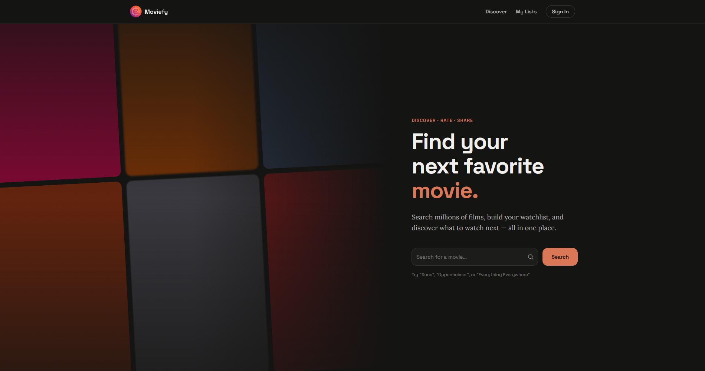

# Moviefy

> Find your next favorite movie.

A cinematic movie discovery app built with SvelteKit 5. Search millions of films, build your watchlist, and discover what to watch next — all in one place.



---

## Overview

Moviefy is a dark-themed movie discovery web app with a modern, streaming-service-inspired UI. The landing page features an animated poster grid that loops like a conveyor belt alongside a search form, making it easy to jump straight into finding films.

## Features

- Movie search form with inline search icon
- Animated movie poster grid (conveyor belt effect)
- Responsive two-column layout — poster grid left, form right
- Full dark theme with warm accent colors
- Internationalization support (English + Spanish via Paraglide)

## Tech Stack

| Category | Tech |
|---|---|
| Framework | SvelteKit 2 + Svelte 5 (runes) |
| Language | TypeScript |
| Styling | Tailwind CSS v4, shadcn-svelte |
| Fonts | Space Grotesk (headers), Lora (body) |
| i18n | Inlang Paraglide (en, es) |
| Testing | Vitest, ~~Playwright~~ |
| Component Docs | Storybook |
| Deployment | Vercel |
| Package Manager | bun |

---

## Getting Started

### Prerequisites

- [Node.js](https://nodejs.org) 18+
- [bun](https://bun.sh)

### Installation

```bash
git clone https://github.com/LucasErrNotFound/moviefy-svelte.git
cd moviefy-svelte
bun install
```

---

## Development

Start the dev server:

```bash
bun dev
```

Open in a new browser tab automatically:

```bash
bun dev --open
```

---

## Building

Create a production build:

```bash
bun build
```

Preview the production build locally:

```bash
bun preview
```

---

## Testing

```bash
# Unit and component tests (Vitest)
bun test:unit

# Run all tests
bun test
```

---

## Linting & Formatting

```bash
bun lint
bun format
```

---

## Storybook

Browse and develop components in isolation:

```bash
bun storybook
```

---

## Project Structure

```
moviefy-svelte/
├── src/
│   ├── lib/
│   │   ├── assets/           # Logo, icons, screenshots
│   │   ├── components/       # Shared components (Navbar, etc.)
│   │   └── components/ui/    # shadcn-svelte UI primitives
│   ├── routes/
│   │   ├── +layout.svelte    # Root layout (Navbar, i18n)
│   │   ├── +page.svelte      # Home landing page
│   │   └── layout.css        # Global styles + Tailwind theme
│   └── app.html              # HTML shell (fonts, dark class)
├── messages/                 # i18n message files (en.json, es.json)
└── ...config files
```

---

## License

This project is licensed under the [GNU Affero General Public License v3.0](LICENSE) (AGPL-3.0).

You are free to use, modify, and distribute this software under the terms of the AGPL-3.0. Any modified versions or software incorporating this code that is made available over a network must also be released under the same license.